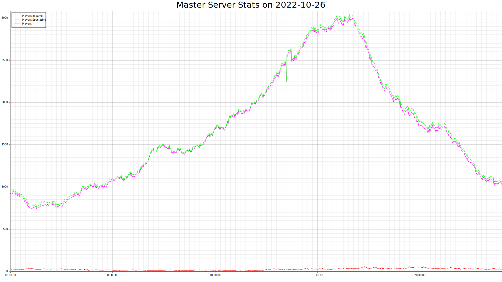

# teemasterparser

Parses the data from one day in https://ddnet.tw/stats/master/ and generates svg images for each day.

Needs to be run using native arch:

```
RUSTFLAGS="-C target-cpu=native" cargo r --release
```

## Result

