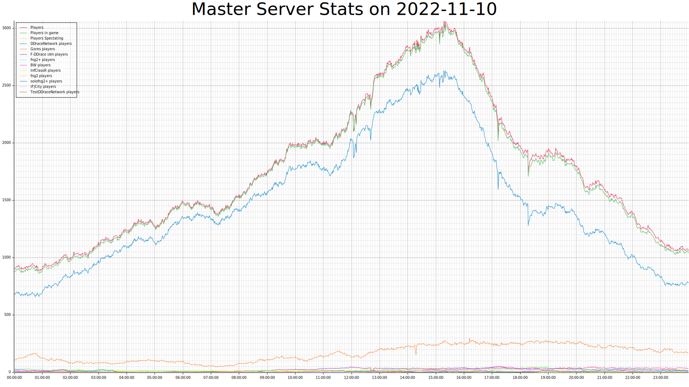

# teemasterparser

Parses the data from one day in https://ddnet.tw/stats/master/ and generates svg images for each day.

# Install
```bash
cargo install teemasterparser
```

## Help
```bash
$ teemasterparser --help
Parses the data from one day in https://ddnet.tw/stats/master/ and outputs a SVG plot with total players.

Usage: teemasterparser [OPTIONS] --out-path <OUT_PATH>

Options:
  -o, --out-path <OUT_PATH>  The path to output the svg file. If it doesn't exist outputs to stdout
  -w, --width <WIDTH>        Width of the svg image [default: 1920]
  -h, --height <HEIGHT>      Height of the svg image [default: 1080]
  -d, --date <DATE>          The day to parse. Defaults to yesterday. Format must be ISO 8601
  -h, --help                 Print help information
  -V, --version              Print version information
```

## Run

Run
```bash
teemasterparser -o example.svg
```

## Example Result

